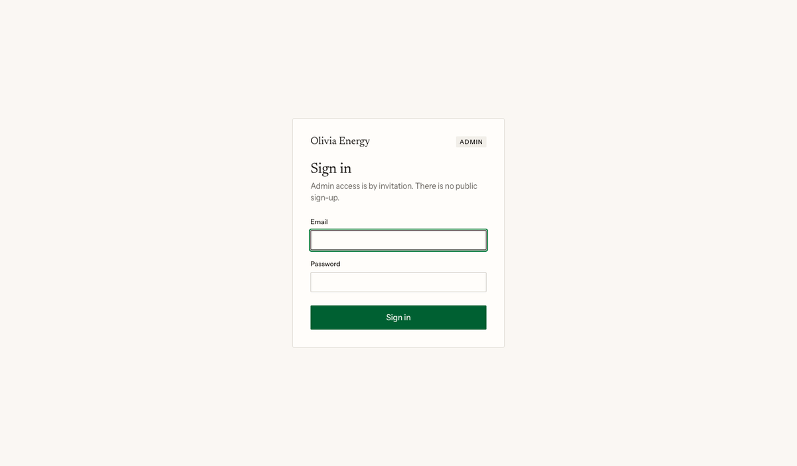
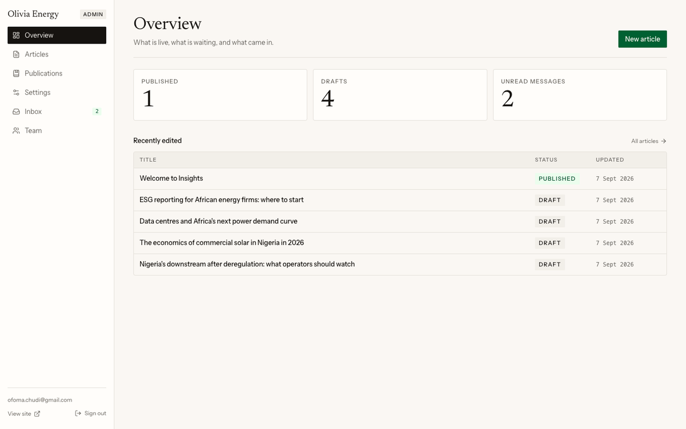
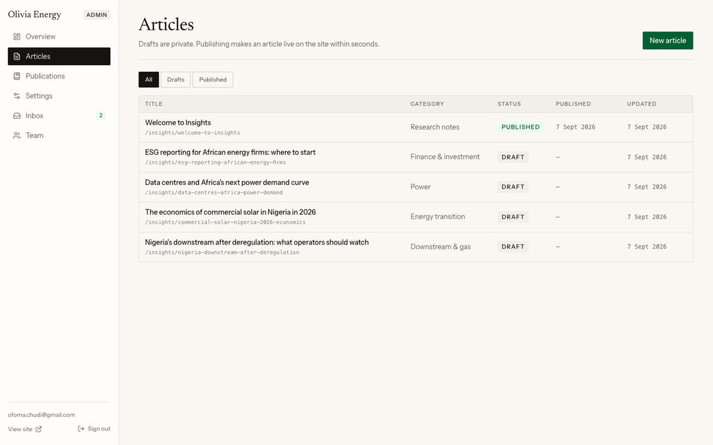
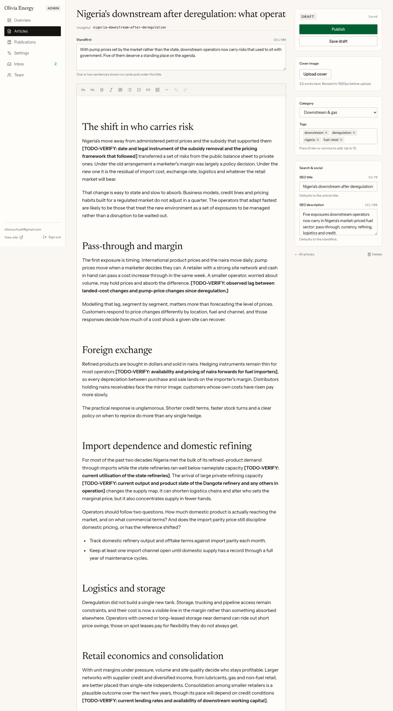
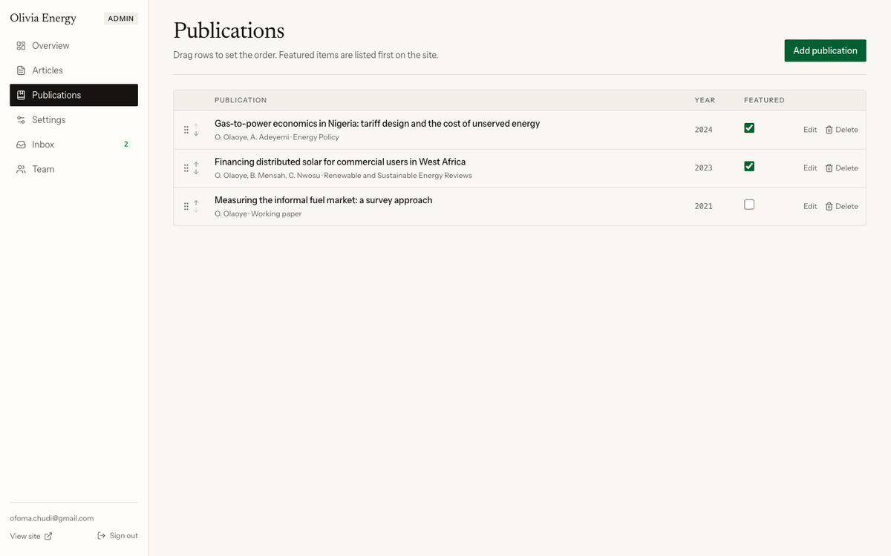
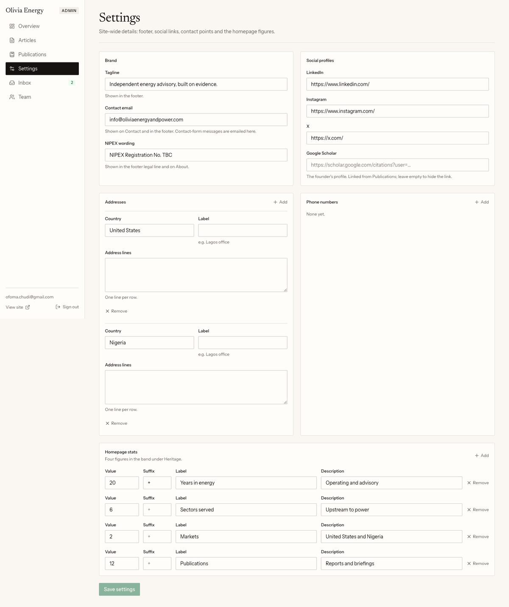
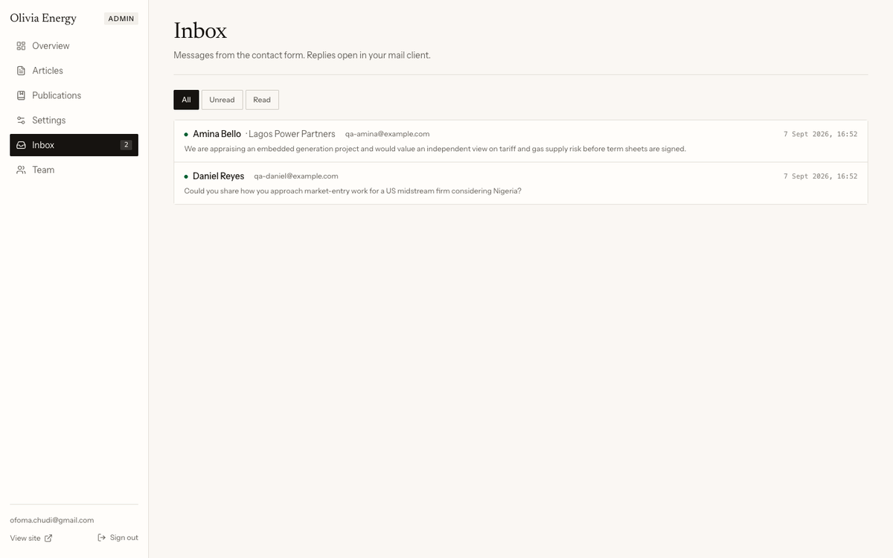
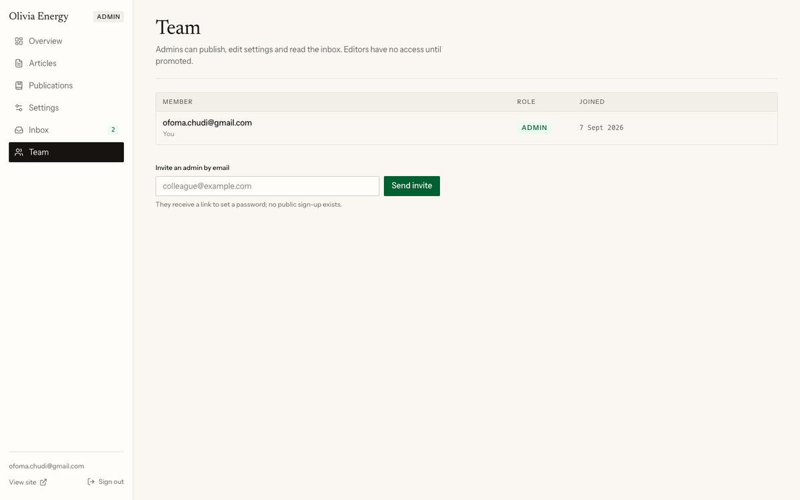

# Admin guide

This guide is for the people who publish on the Olivia Energy website. It
covers signing in, writing and publishing articles, keeping the publications
list and site settings up to date, answering messages from the contact form,
and managing who has access. No technical knowledge is needed.

The admin lives at **yourdomain/admin** (for example
`https://www.oliviaenergyandpower.com/admin`). It works in any modern browser, on a
laptop or a phone.

## Signing in

1. Go to `/admin`. You will be sent to the sign-in screen.
2. Enter the email address you were invited with and your password.
3. If you have forgotten your password, use **Forgot your password?** under
   the form. Enter your email address; if it belongs to an account, a link
   arrives that lets you set a new password.

You stay signed in on that browser until you choose **Sign out** (bottom of
the sidebar, or the door icon on a phone).

## What you see first

The overview shows how many articles are published and in draft, how many
messages are unread, and the articles edited most recently. The sidebar on
the left (or the menu on a phone) takes you to each area:

- **Articles**: the Insights section of the website.
- **Publications**: the founder's papers.
- **Settings**: the wording and details that appear across the site.
- **Inbox**: messages sent through the contact form. The number is how many
  are unread.
- **Team**: who can sign in.

## Writing and publishing an article

### Start a new article

Open **Articles** and click **New article**. A draft is created straight
away and the editor opens. The list can be filtered to show all, drafts or
published articles, and shows when each was last edited.

### The editor

Work down the page:

1. **Title.** Type the headline. The web address (the "slug") is made from it
   automatically while the article is still a fresh draft; you can change it
   by hand, but once an article is published keep the slug the same, or links
   people have shared will stop working.
2. **Standfirst.** One or two sentences under the headline. It also appears
   on the article cards and in search results, so make it a summary rather
   than a teaser.
3. **Body.** Write as you would in a document. The toolbar gives you
   headings (use Heading 2 for sections and Heading 3 inside them), bold,
   italic, a pull quote, bullet and numbered lists, links and images. Select
   text and click the link button to add a link; paste a web address to add
   it quickly.
4. **Images in the text.** Click the image button and choose a file from
   your computer. Large photos are shrunk automatically before upload, so
   you can use them straight from a camera or phone. Add a short description
   in the alt text box for readers who use a screen reader.
5. **Cover.** The wide image at the top of the article and on its card.
   Choose a landscape photo; it is shown at a 3:2 shape and cropped from the
   middle. You can replace or remove it at any time.
6. **Category and tags.** Pick one category from the list (it decides where
   the article appears in the Insights filters). Tags are optional keywords,
   typed one at a time.
7. **Search settings.** Optional. A shorter title and description for search
   engines and social media; the counters show the recommended length. Leave
   them empty to use the headline and standfirst.

The **Save draft** button (or Ctrl+S / Cmd+S) saves without publishing. If
you try to leave the page with unsaved changes, the browser will ask you to
confirm.

### Publish

Click **Publish**. The article appears on the website within a second or
two: on its own page, in the Insights list, and on the home page if it is
among the three newest. There is nothing else to do; no one needs to
redeploy the site.

After publishing, the same button reads **Save changes**, and a **View live**
link opens the public page. **Unpublish** takes an article off the site
again (its page shows "not found" until you publish it once more); it stays
in the admin as a draft with everything intact.

**Delete** removes an article for good; you are asked to confirm.

### Starter articles

Four articles written during the build are published at launch: Nigeria's
downstream after deregulation, the economics of commercial solar in
Nigeria, data centres and Africa's power demand, and ESG reporting for
African energy firms. They are written in the site's voice, and every
figure, date and legal reference in them was checked against a named
source in September 2026. Each ends with a **Sources** list that links to
those sources. They are ordinary articles: edit them as prices, rates and
rules change (update the sentence and its entry under Sources together,
and keep the date in the text so readers can see when a figure applied),
or **Unpublish** any you would rather not carry.

## Publications

**Publications** lists the founder's papers as they appear on the public
Publications page.

- **Add publication** opens a short form: title, authors (in citation order,
  separated by commas), journal or venue, year, a link (the Google Scholar
  entry or the DOI), a one- or two-sentence summary, and a **Featured** box.
- **Featured** papers are shown as cards at the top of the page. Every paper
  appears in the full list below, grouped by year.
- **Reorder** by dragging a row, or with the up and down arrows. The order
  applies within each year on the public page.
- Click a title to edit; **Delete** asks you to confirm.

Changes appear on the site as soon as they are saved.

## Settings

Everything on this screen is shown somewhere on the public site:

- **Tagline**: the line under the wordmark in the footer.
- **Contact email**: shown on the Contact page and in the footer. Messages
  from the contact form are sent to this address.
- **NIPEX wording**: the registration line in the footer and on About.
- **Social profiles**: LinkedIn, Instagram and X links, and the founder's
  Google Scholar profile (linked from Publications; leave it empty to hide
  the link).
- **Addresses** and **Phone numbers**: the office blocks on the Contact page.
  Add or remove entries with the buttons; one address line per row.
- **Homepage stats**: the four figures in the band on the home page.

The figures band only shows on the site once **Show the figures on the
homepage** is checked. Leave it off while any number is still provisional —
flipping it on is the last step, once every figure is confirmed.

The NIPEX line only appears once you type something into **NIPEX wording**.
Leave it empty and the footer and the About page quietly leave the line out
until the registration number is ready.

Click **Save settings**. The site updates on its next load.

## Inbox

Every message sent through the Contact page lands here, unread first. Click
a message to open it.

- **Reply** opens a new email in your own mail program, addressed to the
  sender with their message quoted, so you can answer as you would any
  email. The same message is also emailed to the contact address the moment
  it arrives, so you can answer from your mailbox instead.
- **Mark as read** clears it from the unread count; **Mark as unread** puts
  it back.
- **Delete** removes it; there is no undo.

The form has spam protection, and each email address can send at most three
messages an hour. The words "turnstile passed" under a message mean the
sender passed the human check.

## Team

**Team** lists everyone who can sign in and their role. **Admin** can do
everything described in this guide. **Editor** is the role a person has
until an admin promotes them: they can sign in but see a "no access"
screen, so nobody gains publishing rights by accident.

To add a colleague, enter their email address and click **Send invite**. They
receive an email with a link that lets them set a password; the link expires
after a while, so ask them to use it promptly. You can change a member's
role or remove them; you cannot remove or demote yourself.

## When something looks wrong

- **"That email and password do not match."** Check for a typo; passwords
  are case-sensitive. If it persists, use **Forgot your password?** on the
  sign-in screen.
- **A page says "You do not have access".** Your account is an editor, or
  was removed. Ask an admin.
- **An image will not upload.** Only images (JPEG, PNG, WebP, AVIF, GIF or
  SVG) up to 10 MB are accepted; documents such as PDFs are not. Try a JPEG
  export of the picture.
- **I published, but the website still shows the old version.** Reload the
  page once; if it is still old after a minute, tell the developer (the
  refresh call between the database and the website may need attention).
- **The contact form says it is not available.** The developer needs to
  check the spam-protection and email keys in the hosting settings.

## Words used in this guide

- **Draft**: an article only admins can see.
- **Published**: live on the website.
- **Slug**: the last part of an article's web address, made from its title.
- **Standfirst**: the summary sentence under a headline.
- **Cover**: the main image of an article.
- **Featured**: a publication shown as a card at the top of the page.
